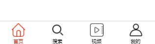
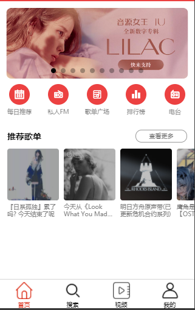
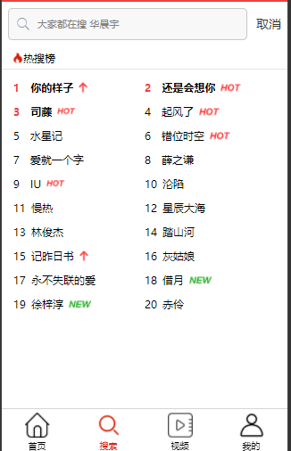
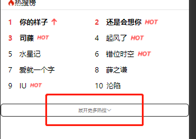
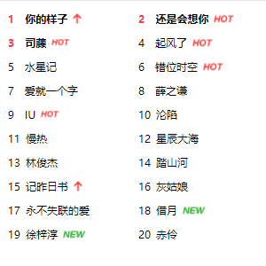
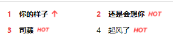

# 网易云音乐 小程序版

## 素材文档

uni-ui文档：https://ext.dcloud.net.cn/plugin?id=55

vue文档：[https://cn.vuejs.org](https://cn.vuejs.org)

配置网络请求:https://www.npmjs.com/package/@escook/request-miniprogram

## tabbar

完成tabbar的布局

 

## 主页功能

 

### 1.获取首页轮播图

通过接口获取轮播图并渲染到页面上

### 2. 图标区域

完成图标的布局

### 3.推荐歌单部分

通过接口获取数据,渲染推荐歌单的部分

## 搜索页功能

 v

### 1.热搜榜

- 通过接口获取热搜榜并渲染到页面上（显示10条数据）

 

- 点击展开更多热搜显示剩下的10条数据

 

 

- 对排名前三的歌曲用红色标记数字

 

 

- 如果返回数据里面有icon，将icon也渲染上去

 

 

- 点击搜索跳转并保存搜索历史(不能重复)

 

- 通过api获取默认搜索关键词并渲染到搜索框里面

 

- 点击清除历史清除搜索历史

 

## 我的页面功能

- 完成对页面的布局

 

